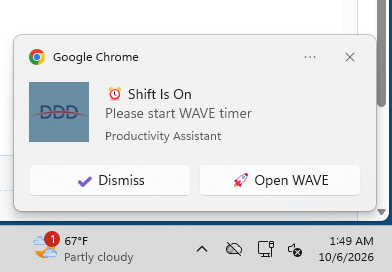
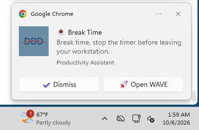

<div align="center">


</div>
# Productivity Assistant

A Chrome Manifest V3 extension that improves productivity tracking and time management across **PRS Productivity Assistant** and **WAVE Timer Reminder**.

---

## 🚀 Installation

Choose the installation method that matches the package you received.

### Option 1: Install from `.crx`

If you received a `.crx` extension package:

1. Open Chrome.
2. Navigate to:

   `chrome://extensions`

3. Enable **Developer mode** using the toggle in the top-right corner.
4. Drag and drop the `.crx` file onto the Extensions page.
5. Confirm the installation if Chrome displays a security prompt.
6. Make sure **Productivity Assistant** appears in the extensions list.
7. Pin the extension to the Chrome toolbar for easy access.

### Option 2: Install from `.zip`

If you received the source code as a ZIP file:

1. Extract the ZIP file to a permanent folder.
2. Open Chrome and navigate to:

   `chrome://extensions`
3. Enable **Developer mode**.
4. Click **Load unpacked**.
5. Select the extracted Productivity Assistant folder.
6. Confirm that the extension appears in the extensions list.
7. Pin the extension to the toolbar.

> **Important:** Do not delete or move the extension folder after loading it unpacked. Chrome loads the extension directly from that folder.

---

## ✅ Verify Installation

After installation, verify that the extension is working correctly.

### 1. Check the Extension

Open:

`chrome://extensions`

Confirm that:

- **Productivity Assistant** is listed.
- The extension is enabled.
- There are no errors displayed.
- The extension icon is visible in the Chrome toolbar if pinned.

### 2. Test the Popup

Click the **Productivity Assistant** icon.

The popup should provide access to:

- WAVE working status
- Current Project, Task, and Subtask
- Shift schedule
- Break schedule
- Save controls
- Launch WAVE
- Open PRS

### 3. Test PRS

Open the PRS system and verify that:

- Project, Task, and Subtask selections are remembered.
- Empty time fields are automatically populated.
- The productivity calendar appears.
- Existing PRS entries are detected.
- Daily productivity information can be viewed.

### 4. Test WAVE

Open WAVE and verify that:

- Project, Task, and Subtask selections are restored.
- Working status is detected.
- Start/stop tracking is monitored.
- Pause/resume tracking is detected.
- Scheduled notifications work according to the configured shift and break times.

---

## 🔄 Updating

### Updating a `.crx` Installation

If you receive a newer `.crx` version:

1. Open `chrome://extensions`.
2. Enable **Developer mode**.
3. Remove the previous version if Chrome does not allow the new package to replace it.
4. Drag the new `.crx` file onto the Extensions page.
5. Confirm that the new version is installed and enabled.

### Updating a "Load unpacked" Installation

If you installed the extension from source:

1. Download or extract the latest version.
2. Replace the contents of the existing extension folder.
3. Open:

   `chrome://extensions`

4. Locate **Productivity Assistant**.
5. Click **Reload**.
6. Refresh any PRS or WAVE tabs where the extension is being used.

> **Tip:** After an update, refreshing PRS and WAVE tabs ensures that the latest content scripts are loaded.

---

# 📖 Overview

Productivity Assistant combines productivity tracking, field automation, calendar monitoring, shift reminders, and WAVE timer monitoring into a single Chrome extension.

It consists of two primary components:

- **PRS Productivity Assistant** — manages PRS entries, productivity history, calendar information, and payroll estimates.
- **WAVE Timer Reminder** — monitors WAVE working status and provides shift and break reminders.

The extension also provides a popup for managing saved selections and work schedules.

---

# ✨ Features

## 📊 PRS Productivity Assistant

### Smart Field Memory

The extension remembers frequently used PRS selections:

- Project
- Task
- Subtask

Saved selections are automatically restored when available, reducing repetitive data entry.

### Automatic Time Filling

When PRS fields are empty, the extension can automatically populate:

| Field | Default |
|---|---:|
| Start Time | `08:00` |
| End Time | `17:00` |
| Break Time | `01:00` |
| Units Completed | `480` |

### Productivity Calendar

A floating, draggable calendar provides a visual overview of PRS activity.

The calendar:

- Displays the current month.
- Allows navigation to previous months.
- Synchronizes productivity data in the background.
- Aggregates PRS activity by date.
- Highlights attendance and productivity patterns.

### Calendar Status Colors

| Color | Meaning |
|---|---|
| 🟢 Green | PRS entry completed |
| 🔴 Red | Weekday without a PRS entry |
| 🔵 Blue | Saturday worked for more than 2 hours |
| 🟡 Yellow | Warning or unusual activity |
| ⚪ Gray | Weekend, older, or upcoming date |

### Daily Productivity Details

Selecting a date opens a detailed view containing:

- PRS entries
- Daily working hours
- Break information
- Productivity information
- Warnings and exceptions

### Automatic Data Synchronization

A background scraper monitors the PRS productivity table and synchronizes available entries with the extension's calendar data.

This allows the calendar to remain updated without requiring manual data entry.

### Productivity Warnings

The extension identifies potentially problematic entries, including:

- Breaks longer than one hour.
- Working periods exceeding 11 hours.
- Multiple entries for the same date.
- Sunday entries.

These warnings help identify unusual or potentially incorrect PRS records.

---

## 💰 Payroll Estimate

The PRS calendar can estimate earnings using the configured pay period.

### Pay Period

The calculation uses a:

**25th → 24th**

pay period.

### Days Present

Days present are calculated from:

- Weekdays with completed PRS entries.
- Qualifying Saturdays.

### Daily Rate

The estimated daily rate is calculated as:

`Monthly Pay ÷ Weekdays in Pay Period`

### Estimated Payroll

The estimated payroll is calculated as:

`Days Present × Daily Rate`

The previous pay period is hidden during the **1st–24th** of the month where applicable.

> **Note:** Payroll calculations are estimates and should not be treated as official payroll records.

---

## ⏰ PRS Shift-End Reminder

The extension supports shift-related reminders to help users monitor their scheduled working period and avoid unintentionally extending their shift.

---

# ⏱️ WAVE Timer Reminder

WAVE Timer Reminder monitors the WAVE interface and helps ensure that the WAVE timer matches the user's working schedule.

## Working Status Tracking

The extension stores the current WAVE state in:

`chrome.storage.local`

The `workingStatus` value represents whether the user is currently working.

| Value | Meaning |
|---|---|
| `true` | Working / WAVE timer running |
| `false` | Not working |

State changes are logged with:

- Previous value
- New value
- Reason
- Timestamp

---

## WAVE Button Monitoring

The WAVE content script monitors:

- `#trackBtn`
- `#pauseBtn`

### Pause Button

| Button State | Working Status |
|---|---|
| `Pause (Break)` | `true` |
| `Resume Tracking` | `false` |

### Tracking Button

| Button State | Working Status |
|---|---|
| `Start Tracking` | `false` |
| Stop Tracking → Start Tracking | `false` |

This allows the extension to maintain an accurate representation of the WAVE timer state.

---

## 🔄 WAVE Auto-Fill

The extension automatically restores:

- Project
- Task
- Subtask

When WAVE loads, the extension:

1. Waits for the selection fields to appear.
2. Attempts to restore the saved values.
3. Retries if the fields are not immediately available.
4. Falls back to the first available option when a saved value cannot be found.
5. Saves changes when selections are manually changed.
6. Stores both selection IDs and display names.

The extension retries up to three times with approximately two-second intervals.

While working, selections can be refreshed periodically to keep the stored state synchronized.

---

# 🕐 Shift & Break Scheduling

Shift and break times can be configured through the extension popup.

The schedule can include:

- Shift start
- Shift end
- First break start
- First break end
- Second break start
- Second break end

The configured schedule controls WAVE reminders and status checks.

---

# 🔔 Notifications

Productivity Assistant uses Chrome's native notification system to remind users about important schedule events.

### Shift Started

Triggered at the configured shift start time when WAVE is not running.

### Break Time

Triggered when a scheduled break begins.

### Break Ended

Triggered when a scheduled break ends.

### Shift Ended

Triggered at the configured shift end time when WAVE is still running.

### Start WAVE Reminder

If the shift is active and WAVE has not been started, the extension periodically reminds the user to start the timer.

### Post-Shift Reminder

If WAVE remains active after the scheduled shift ends, the extension periodically reminds the user that the shift has ended.

### Protected Stop Notification

When stopping WAVE is restricted during a protected period, the extension can display:

**Can't Stop Tracking Yet**

---

## 🔔 Notification Controls

Notifications can include:

- **Dismiss**
- **Open WAVE**

The extension ensures that only one extension notification is displayed at a time.

When a new extension notification is displayed, the previous extension notification is cleared.

Clicking the extension popup also clears extension notifications where applicable.

Daily schedule events use state guards to prevent the same shift or break notification from repeatedly triggering.

---

# 🖥️ Extension Popup

The popup provides a central interface for managing the extension.

It displays:

### Working Status

- Working
- Not Working

### Current Selections

- Project
- Task
- Subtask

### Schedule Settings

- Shift start
- Shift end
- First break
- Second break

### Actions

- Save schedule
- Launch WAVE
- Open PRS

The popup also provides feedback when settings have been successfully saved.

---

# ⚙️ How It Works

The extension uses several coordinated components.

### PRS Workflow

1. PRS loads in Chrome.
2. The content script detects relevant fields and productivity data.
3. Saved selections are restored.
4. Empty fields are automatically populated where configured.
5. Productivity data is synchronized.
6. Calendar information is updated.
7. Daily entries and warnings are calculated.
8. Payroll estimates are generated from the configured pay period.

### WAVE Workflow

1. WAVE loads in Chrome.
2. The content script detects Project, Task, and Subtask fields.
3. Saved selections are restored.
4. WAVE tracking controls are monitored.
5. Working status is updated.
6. Background alarms monitor the configured schedule.
7. Shift and break events trigger notifications.
8. Post-shift and missing-timer conditions are monitored.

---

# 🛡️ Reliability & Self-Healing

The extension includes several mechanisms designed to improve reliability.

### Service Worker Boot

A top-level initialization routine ensures that required background functionality is registered when the service worker starts.

### Timer Watch

The `timerWatch` alarm acts as a periodic heartbeat and checks scheduled events.

### Status Checks

The `statusCheck` alarm periodically verifies WAVE status after the shift begins.

### Storage Monitoring

A storage-change listener responds when relevant settings or working-state values change.

### Chrome Idle Monitoring

The extension can monitor Chrome's idle state where required by its workflow.

### Self-Healing Alarms

Expected alarms can be recreated if they are missing.

### Safe Status Checks

Status checks favor pure reads where possible to reduce unnecessary state changes.

### Notification Management

Notifications are tracked using an active notification ID and cleared using extension-specific notification handling.

---

# 🏗️ Architecture

```text
Productivity Assistant
│
├── background.js
│   └── Service worker
│       ├── WAVE scheduling
│       ├── Alarms
│       ├── Notifications
│       ├── Working-status monitoring
│       └── Reliability / self-healing
│
├── prs-content.js
│   └── PRS automation
│       ├── Field memory
│       ├── Auto-fill
│       ├── Productivity scraping
│       ├── Calendar
│       └── Payroll estimates
│
├── wave-content.js
│   └── WAVE automation
│       ├── Field restoration
│       ├── Button monitoring
│       └── Working-status detection
│
├── popup.html
│   └── Extension interface
│
├── popup.js
│   └── Popup logic
│
├── styles.css
│   └── Popup styling
│
└── images/
    ├── logo128.png
    ├── prs.png
    ├── hours.png
    ├── popup.png
    ├── shift.png
    └── break.png
```

---

# 🗄️ Storage

The extension uses Chrome local storage for configuration and runtime state.

| Key | Purpose |
|---|---|
| `savedProjectId` | Saved Project |
| `savedTaskId` | Saved Task |
| `savedSubtaskId` | Saved Subtask |
| `prsCalendar` | PRS calendar/productivity data |
| `workingStatus` | Current WAVE working state |
| `assignedProject*` | WAVE project information |
| `assignedTask*` | WAVE task information |
| `assignedSubtask*` | WAVE subtask information |
| `shiftStart` | Shift start time |
| `shiftStop` | Shift end time |
| `firstBreak*` | First break schedule |
| `secondBreak*` | Second break schedule |
| `scheduleState` | Daily schedule-event state |
| `currentNotificationId` | Active notification |
| `lastPleaseStartAlert` | Last start-WAVE reminder |
| `lastPostShiftAlert` | Last post-shift reminder |

---

# 🖼️ Screenshots

## PRS Productivity Calendar


## Daily Hours & Productivity Details


## Extension Popup


## Shift Schedule



## Break Schedule



---

# 🧭 Quick Reference

| Function | PRS | WAVE |
|---|:---:|:---:|
| Remember Project | ✓ | ✓ |
| Remember Task | ✓ | ✓ |
| Remember Subtask | ✓ | ✓ |
| Automatic field filling | ✓ | ✓ |
| Working-status tracking | — | ✓ |
| Productivity calendar | ✓ | — |
| Daily productivity details | ✓ | — |
| Productivity warnings | ✓ | — |
| Payroll estimate | ✓ | — |
| Shift scheduling | ✓ | ✓ |
| Break scheduling | ✓ | ✓ |
| Native notifications | — | ✓ |
| Popup controls | ✓ | ✓ |

---

# 🛠️ Troubleshooting

## Extension does not appear

Open:

`chrome://extensions`

Confirm that:

- Developer mode is enabled when using an unpacked or `.crx` installation.
- The extension is installed.
- The extension is enabled.
- Chrome does not display an extension error.

## PRS fields are not automatically filled

Try:

1. Refreshing the PRS page.
2. Opening the extension popup.
3. Checking that Project, Task, and Subtask values are saved.
4. Selecting the fields manually once and allowing the extension to save them.

## WAVE selections are not restored

Try:

1. Refreshing WAVE.
2. Waiting for the page to finish loading.
3. Checking the saved Project, Task, and Subtask.
4. Opening the popup and confirming the saved selections.

## Notifications are not appearing

Check:

- Chrome notification permissions.
- Shift and break schedule settings.
- WAVE working status.
- Whether the extension is enabled.
- Whether another extension notification is currently active.

Then reload the extension from:

`chrome://extensions`

## Extension stopped working after an update

After updating:

1. Reload the extension.
2. Refresh PRS.
3. Refresh WAVE.
4. Reopen the extension popup.
5. Confirm the schedule and saved selections.

---

# 🗑️ Uninstalling

To remove Productivity Assistant:

1. Open:

   `chrome://extensions`

2. Locate **Productivity Assistant**.
3. Click **Remove**.
4. Confirm the removal.

If you installed the extension as an unpacked extension, you can also delete the local extension folder after removing it from Chrome.

---

# 🔮 Roadmap

Planned improvements may include:

- Supervisor portal
- Team dashboard
- Live attendance and working-status monitoring
- Idle alerts
- Compliance reports
- One-click supervisor nudges
- CSV export
- Team productivity heatmaps
- Productivity leaderboards
- Dark mode
- Localization
- Voice reminders
- Slack integration
- Microsoft Teams integration

---

# 🤝 Contributing

Contributions, suggestions, bug reports, and feature requests are welcome.

When submitting an issue or pull request, provide:

- A clear description of the problem or feature.
- Steps to reproduce the issue where applicable.
- Relevant screenshots or error messages.
- Chrome version.
- Extension version.

---

# 📄 License

This project is licensed under the **MIT License**.

---

## 👨‍💻 Developer

**Collins Mrumba**

Built to simplify productivity tracking, automate repetitive tasks, and help users maintain accurate PRS and WAVE work records.
