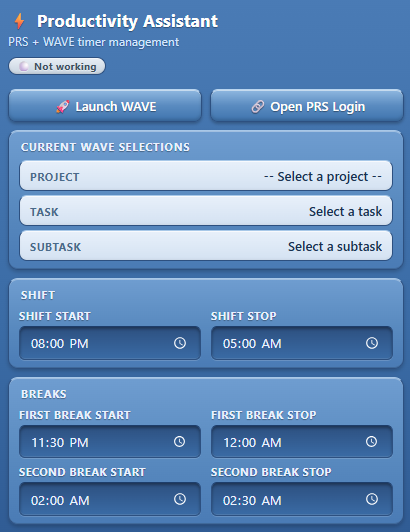
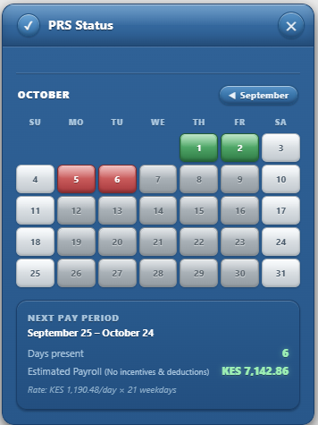
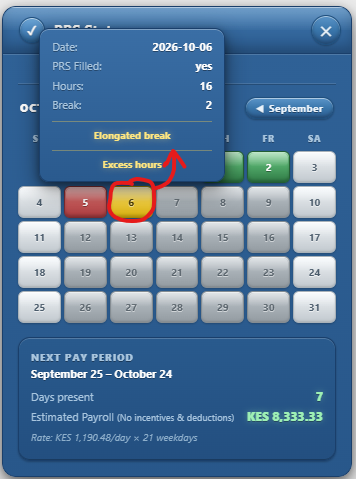

# 🧩 Productivity Assistant

**Productivity-boosting Chrome extension for PRS and WAVE.**

Remembers your form selections · auto-fills your daily productivity entries · paints a live payroll calendar · reminds you to start, pause, and stop your WAVE timer· reminds you to Fill your PRS entries.

 

 

[**Features**](#-features) · [**Installation**](#-installation) · [**How It Works**](#-how-it-works) · [**Architecture**](#-architecture) · [**Roadmap**](#-roadmap) · [**Contributing**](#-contributing) · [**License**](#-license)

---

## 📖 Overview

**Productivity Assistant** is a single Chrome extension that bundles **two independent functionalities** for the PRS and WAVE web apps:

## 🚀 Installation

<table>
  <tr>
    <th width="50%">Method 1 — `.crx` Drag & Drop <em>(quickest)</em></th>
    <th width="50%">Method 2 — `.zip` + Developer Mode <em>(recommended)</em></th>
  </tr>
  <tr valign="top">
    <td>
      <ol>
        <li>Download the <code>.crx</code> file from the <a href="../../"><b>Releases</b></a> page.</li>
        <li>Open <code>chrome://extensions</code> (or Click Settings -> then click Extensions).</li>
        <li>Enable <b>Developer mode</b> (top-right toggle).</li>
        <li><b>Drag</b> the <code>.crx</code> file onto the page.</li>
        <li>Confirm the prompt.</li>
        <li>The extension icon appears in the toolbar.</li>
      </ol>
      

      
⚠️ Chrome may block <code>.crx</code> files for non-Web-Store extensions. If that happens, use <b>Method 2</b>.

    </td>
    <td>
      <ol>
        <li>Download the <code>.zip</code> from the <a href="../../"><b>Releases</b></a> page.</li>
        <li>Extract it to a permanent folder.</li>
        <li>Open <code>chrome://extensions</code> (or Click Settings -> then click Extensions).</li>
        <li>Enable <b>Developer mode</b> (top-right toggle).</li>
        <li>Click <b>Load unpacked</b>.</li>
        <li>Select the extracted folder.</li>
        <li>The extension icon appears in the toolbar.</li>
      </ol>
      

      
✅ Works on all platforms, easier to update manually, and won't be blocked by Chrome.

    </td>
  </tr>
</table>

### 📋 Before You Begin

| Requirement | Details |
|---|---|
| **Browser** | Google Chrome |
| **OS** | Windows |
| **Access** | The official GitHub repository for Productivity Assistant |
| **Network** | Ability to reach PRS and WAVE sites |

### ✅ Verify the Installation

- The extension icon appears in the toolbar.
- Click it → the popup opens with the **Current Selections**, **Shift**, and **Breaks** panels.
- Open PRS / WAVE → the content scripts run and the auto-fill kicks in.

### 🩺 Troubleshooting

| Problem | Fix |
|---|---|
| Extension doesn't appear | Make sure **Developer mode** is on and you loaded the right folder |
| `.crx` blocked by Chrome | Use **Method 2 (.zip + Load unpacked)** instead |
| Popup blank | Reload the extension, then reopen the popup |
| No notifications | Check Windows → Settings → System → Notifications → Google Chrome is allowed and Do Not Disturb is off |
| WAVE auto-fill not working | Reload the WAVE page once after install |

### 🔄 Updating the Extension

- **Method 1** — download the new `.crx` and drag it onto `chrome://extensions` again
- **Method 2** — replace the contents of the loaded folder, then click the **Reload** icon on the extension card

### 🗑️ Uninstalling

1. Open `chrome://extensions`
2. Find **Productivity Assistant**
3. Click **Remove**

## The extension's popup functionality

## 🚀 Quick Actions

- **🚀 Launch WAVE** — opens the WAVE site in a single click.
- **📂 Open PRS Site** — opens the PRS webpage in a single click.

> No more manually copy-pasting URLs or digging through your bookmarks — both sites are always one click away.

---

## 🟢 Working Status Indicator

The chip above the timer shows whether or not you are currently logging time:

- 🟢 **"Working"** — the WAVE timer is **on**.
- ⚪ **"Not Working"** — the WAVE timer is **off**.

---

## 📋 Current WAVE Selections

The **Current Selections** panel displays your **Project**, **Task**, and **Subtask** exactly as they are saved in Chrome storage. This mirrors what the content script has captured from the WAVE page, so you always know what you're currently working on.

---

## ⏰ Shift & Break Times

You can adjust the time fields to receive notifications at the right moments for **your** shift.

> ⚠️ The extension ships with **default values for a night shift**. If your schedule differs, change these fields the first time you install the extension.

| Field | Default |
|---|---|
| 🕗 **Shift Start** | `8:00 PM` |
| 🕔 **Shift Stop** | `5:00 AM` |
| ☕ **First Break Start** | `11:30 PM` |
| ☕ **First Break Stop** | `12:00 PM` |
| ☕ **Second Break Start** | `2:00 AM` |
| ☕ **Second Break Stop** | `2:30 AM` |

> 📌 Remember to update these fields on first install so the reminders fire at the correct times.

## The extension's PRS widget functionality

## 📅 PRS Productivity Calendar

The PRS widget embeds itself directly on the PRS webpage when you open the **productivity / create** page.

### 🗓️ Calendar View

- Displays the **current month** at a glance.
- **Navigate to previous months** to review your history.
- **Auto-syncs** with the background scraper, which walks through every page of your productivity table so the calendar always reflects what's actually logged.

### 🎨 Color-Coded Days

| Color | Meaning |
|---|---|
| 🟢 **Green** | A PRS entry has been filled for that day |
| 🔴 **Red** | Weekday with **no** PRS entry |
| 🟡 **Yellow** | Multiple entries on the same day, or a warning state |
| 🔵 **Blue** | Saturday worked (more than 2 hours) |
| ⚪ **Gray** | Weekend, older, or upcoming day |

### 💰 Estimated Payout

The widget also shows an **estimated payout** for the current month, computed from the standard daily rate for the current pay period.

> ⚠️ **The figure is an estimate.**
>
> - 📉 It may be **lower** if you don't meet the metrics set for your project.
> - 📈 It may be **higher** if you exceed the target.

### 🚧 Work in Progress

> The PRS widget is still **under active development**. If you notice any discrepancy in the calculations, please **notify the developer** so it can be corrected.

## 🗓️ Day Popup

Click any date on the calendar to open a popup showing **every PRS entry logged for that day** — no need to open the list page or search manually.

### What You'll See

- **All entries for that date** — each one listed with its details so you can review exactly what was submitted.
- **Warning reasons** — if the day is coloured yellow, the popup explains *why*:
  - ⏱️ **Excess hours** — the daily total exceeds **11 hours**.
  - ☕ **Elongated break** — the break exceeds **1 hour**.
- **Multiple entries** — a yellow date with a warning like the above means PRS was filled **twice for the same date**.

> 💡 A yellow day isn't just a colour — it's a signal. Open it to see which condition triggered the warning and correct the entry if needed.

<table>
  <tr>
    <th width="50%">🧠 PRS Auto-fills</th>
    <th width="50%">⏰ WAVE Timer Reminder</th>
  </tr>
  <tr valign="top">
    <td>

Automates the PRS productivity flow:

- Remembers **Project / Task / Subtask** picks
- Auto-fills common fields on load
- Paints a **live payroll calendar**
- Syncs data from a hidden background tab

    </td>
    <td>

Watches the WAVE fill-productivity page and reminds you to start / pause / stop your timer:

- Tracks one boolean: **`workingStatus`**
- Fires notifications based on your **shift & break schedule**
- Auto-fills the WAVE dropdowns

    </td>
  </tr>
</table>

Both functionalities share the same storage, popup, and service worker. You can use either one, or both together.

---

---
## ✨ Features

### 🧠 PRS Auto-fills

<table>
  <tr>
    <td width="50%" valign="top">
      <h4>Smart Field Memory</h4>
      
Your <b>Project</b>, <b>Task</b>, and <b>Subtask</b> selections are saved automatically and restored the next time you open a create page. Never re-pick the same options again.

      <ul>
        <li><b>Project</b> — restored from storage, or defaults to the first real project</li>
        <li><b>Task</b> — restored only if you've saved one</li>
        <li><b>Subtask</b> — restored only if you've saved one</li>
      </ul>
    </td>
    <td width="50%" valign="top">
      <h4>Auto-fill on Load</h4>
      
Four common fields are filled the instant the page loads — but only if they're empty, so your own edits are never overwritten.

      <table width="100%">
        <tr>
          <th>Field</th>
          <th>Value</th>
        </tr>
        <tr>
          <td><code>startTime</code></td>
          <td><code>08:00</code></td>
        </tr>
        <tr>
          <td><code>endTime</code></td>
          <td><code>17:00</code></td>
        </tr>
        <tr>
          <td><code>breaktime</code></td>
          <td><code>01:00</code></td>
        </tr>
        <tr>
          <td><code>units_completed</code></td>
          <td><code>480</code></td>
        </tr>
      </table>
    </td>
  </tr>
  <tr>
    <td width="50%" valign="top">
      <h4>📅 Live Productivity Calendar</h4>
      
A floating, draggable widget paints a color-coded calendar so you can see your month at a glance.

      <table width="100%">
        <tr>
          <th>Color</th>
          <th>Meaning</th>
        </tr>
        <tr>
          <td>🔴 Red</td>
          <td>Weekday, no PRS entry</td>
        </tr>
        <tr>
          <td>🟢 Green</td>
          <td>PRS filled</td>
        </tr>
        <tr>
          <td>🔵 Blue</td>
          <td>Saturday worked (&gt; 2h)</td>
        </tr>
        <tr>
          <td>🟡 Yellow</td>
          <td>Warning state</td>
        </tr>
        <tr>
          <td>⚪ Gray</td>
          <td>Weekend / older / upcoming</td>
        </tr>
      </table>
    </td>
    <td width="50%" valign="top">
      <h4>⚠️ Warning States</h4>
      
Two conditions trigger a <b>yellow</b> day cell and a popup warning:

      <ul>
        <li><b>Elongated break</b> — break exceeds <b>1 hour</b></li>
        <li><b>Excess hours</b> — daily hours exceed <b>11 hours</b></li>
      </ul>
      
Sundays with entries are flagged as errors too.

    </td>
  </tr>
  <tr>
    <td width="50%" valign="top">
      <h4>💰 Payroll Summary</h4>
      
Automatic <b>25th &rarr; 24th</b> pay-period math:

      <ul>
        <li><b>Days present</b> — weekdays filled + qualifying Saturdays</li>
        <li><b>Daily rate</b> — <code>monthly pay &divide; weekdays in period</code></li>
        <li><b>Payroll</b> — <code>daysPresent &times; dailyRate</code></li>
      </ul>
      
Previous pay period hides during the 1st–24th window.

    </td>
    <td width="50%" valign="top">
      <h4>🔄 Background Sync</h4>
      
The extension silently scrapes your productivity table, aggregates rows by <code>(date)</code>, and syncs the calendar.

    </td>
  </tr>
</table>

---

### ⏰ WAVE Timer Reminder

The Chrome extension reminds you to start, pause, and stop your WAVE timer — based on your shift and break schedule.

> Everything the WAVE functionality does revolves around **one boolean** stored in `chrome.storage.local`: **`workingStatus`**.

| Value | Meaning |
|:---:|---|
| 🟢 `true` | The user is working (WAVE timer is running) |
| ⚪ `false` | The user is not working |

> Every change to `workingStatus` is logged to the service worker console with the **old value**, **new value**, **reason**, and **timestamp**.

#### 🔄 How `workingStatus` Is Set

The content script observes two buttons on the WAVE page:

- 🎬 `#trackBtn` — toggles between **"Start Tracking"** and **"Stop Tracking"**
- ☕ `#pauseBtn` — toggles between **"Pause (Break)"** and **"Resume Tracking"**

| Button state | `workingStatus` |
|---|:---:|
| `pauseBtn` visible + `"Pause (Break)"` | 🟢 **`true`** |
| `pauseBtn` visible + `"Resume Tracking"` | ⚪ **`false`** |
| `trackBtn` visible + `"Start Tracking"` | ⚪ **`false`** |
| `trackBtn` visible + transition `"Stop Tracking"` → `"Start Tracking"` | ⚪ **`false`** |

#### 📅 The Schedule

| Window | Default |
|---|---|
| 🕗 **Night Shift** | `20:00` → `05:00` |
| ☕ **First break** | `00:00` → `00:30` |
| ☕ **Second break** | `02:30` → `03:00` |

#### ⏱️ Alarms

| Alarm | Period | Purpose |
|---|:---:|---|
| 🔔 `timerWatch` | **1 min** | Fires schedule-event checks; ensures `statusCheck` exists; runs `checkStatus()` |
| 🔔 `statusCheck` | **5 min** *(or 10 after shift end)* | Fires the periodic reminders |

#### 🔔 Notifications

All notifications are **Windows-native Chrome notifications** with two buttons: **✔ Dismiss** and **🚀 Open WAVE**.

| Notification | When it fires | Condition |
|---|---|---|
| 🌅 **Shift Started** | At `shiftStart` | `workingStatus === false` |
| ☕ **Break Time** | At `firstBreakStart` and `secondBreakStart` | *Always fires* |
| ⏱️ **Break Ended** | At `firstBreakStop` and `secondBreakStop` | *Always fires* |
| 🌇 **Shift Ended** | At `shiftStop` | `workingStatus === true` |
| ⏰ **Shift Is On** — *"Please start WAVE timer"* | Every 5 minutes | Inside shift + `workingStatus === false` + not during a break |
| 🌇 **Shift ended at {HH:MM}, kindly stop the timer** | Every 10 minutes after shift end | `workingStatus === true` |
| ⚠️ **Can't Stop Tracking Yet** | Stop Tracking clicked inside a protected window | Message from content script |

> 🧹 **Every new notification clears all existing extension notifications first.** There is never more than one extension notification visible at a time.

> 📌 **Once-per-day guard** — shift-start, all four break notifications, and shift-stop fire at most once per day, keyed by `scheduleState`. The **⏰ Please start WAVE timer** and **🌇 Shift ended…** reminders repeat on their cadence.

#### 🔍 The Two Periodic Checks

**🕐 `checkScheduleEvents()` — every minute:** evaluates the current minute against `shiftStart`, `shiftStop`, and the four break times (±1 min tolerance).

**🕔 `checkStatus()` — every 5 minutes *(or 10)*:**

| Mode | Condition | Action |
|---|---|---|
| 🅰️ **Idle during shift** | Inside shift + `workingStatus === false` + not during break | **⏰ Please start WAVE timer** |
| 🅱️ **Post-shift working** | After shift end + `workingStatus === true` | **🌇 Shift ended at {HH:MM}…** (10-min cadence) |
| 🅲 **Outside shift, idle** | Outside shift + `workingStatus === false` + not during break | No notification (alarm stays armed) |

#### ✍️ WAVE Auto-Fill

On page load, the content script restores the user's last-selected **project / task / subtask** from storage:

1. ⏳ Waits up to **3–4 seconds** for each `<select>` to populate
2. ↩️ Restores the saved value if it exists
3. ➡️ Falls back to the **first available option** otherwise

Retries up to **3 times**, **2 s apart**. Every change is written back to storage with its display name. While `workingStatus === true`, selections refresh **every 2 seconds**.

---

## 🪟 The Popup

The popup is **shared by both functionalities** and shows:

- 🟢 **Status chip** (*Working* / *Not working*) driven by `workingStatus`
- 📋 Current **project / task / subtask** names
- ⏰ Editable **shift and break times** (with a *"✅ Saved"* indicator)
- 🚀 **Launch** button that opens WAVE and closes the popup

> Any click anywhere in the popup **clears all extension notifications**.

---

## 🏗️ Architecture

<table>
  <tr>
    <th>Component</th>
    <th>File</th>
    <th>Role</th>
  </tr>
  <tr>
    <td>🔧 **Service Worker**</td>
    <td>`background.js`</td>
    <td>Owns the schedule, the state, and all notifications</td>
  </tr>
  <tr>
    <td>🌐 **Content Scripts**</td>
    <td>`prs-content.js` · `wave-content.js`</td>
    <td>Injected into the PRS / WAVE pages; observe DOM, mirror state into storage</td>
  </tr>
  <tr>
    <td>🪟 **Popup**</td>
    <td>`popup.html` / `popup.js`</td>
    <td>Shows current status, current selections, and shift/break editors</td>
  </tr>
  <tr>
    <td>🎨 **Styles**</td>
    <td>`styles.css`</td>
    <td>Glossy popup theme and in-page widget styling</td>
  </tr>
</table>

---

## 🗄️ Storage Keys

| Key | Site | Purpose |
|---|---|---|
| `savedProjectId` / `savedTaskId` / `savedSubtaskId` | PRS | Persisted dropdown selections |
| `prsCalendar` | PRS | Scraped calendar data |
| `workingStatus` | WAVE | Single source of truth for timer state |
| `assignedProject*` / `assignedTask*` / `assignedSubtask*` | WAVE | Live WAVE form selections |
| `shiftStart`, `shiftStop`, `firstBreak*`, `secondBreak*` | WAVE | Schedule config |
| `scheduleState` | WAVE | Once-per-day notification fired flags |
| `currentNotificationId` | WAVE | Currently displayed notification ID |
| `lastPleaseStartAlert` / `lastPostShiftAlert` | WAVE | Reminder cooldown timestamps |

---

## 🛡️ Reliability Mechanisms (WAVE)

1. 🔁 **Top-level boot IIFE** — runs on every service-worker boot (install, update, reload, browser start, first wake-up)
2. ⏱️ **`timerWatch` every minute** — the reliable heartbeat
3. 📥 **Storage change listener** — re-evaluates on every `workingStatus` change
4. 💤 **`chrome.idle`** — re-evaluates on screen unlock
5. 🩹 **Self-healing alarms** — recreated on every tick
6. 🔒 **Pure reads in `checkStatus`** — no side effects, no races
7. 🧹 **Prefix-scoped notification clearing** — only the extension's own notifications are cleared

---

## 🎬 End-to-End Example (WAVE)

> Shift `20:00 → 05:00` · First break `00:00 → 00:30` · Second break `02:30 → 03:00`

| Time | Event | `workingStatus` | Notification |
|:---:|---|:---:|---|
| `19:55` | — | ⚪ `false` | — |
| `20:00` | Shift starts | ⚪ `false` | 🌅 Shift Started |
| `20:05` | 5-min tick | ⚪ `false` | ⏰ Please start WAVE timer |
| `20:15` | User clicks **Start Tracking** | ⚪ `false` | — |
| `20:30` | User clicks **Pause (Break)** | 🟢 `true` | — |
| `00:00` | First break starts | 🟢 `true` | ☕ Break Time |
| `00:15` | User clicks **Resume Tracking** | ⚪ `false` | — |
| `00:30` | First break ends | ⚪ `false` | ⏱️ Break Ended |
| `02:30` | Second break starts | 🟢 `true` | ☕ Break Time |
| `03:00` | Second break ends | ⚪ `false` | ⏱️ Break Ended |
| `03:05` | 5-min tick | ⚪ `false` | ⏰ Please start WAVE timer |
| `05:00` | Shift ends | ⚪ `false` | — |
| **Alt scenario** | | | |
| `05:00` | Shift ends | 🟢 `true` | 🌇 Shift Ended |
| `05:10` | Still working | 🟢 `true` | 🌇 Shift ended at 05:00… |
| `05:30` | User clicks **Resume Tracking** | ⚪ `false` | — |

---

## 🚀 Roadmap

### 📊 Supervisor & Team Lead Dashboard

| Feature | Description |
|---|---|
| 🧑‍💼 **Supervisor Portal** | Web dashboard where supervisors log in with their team code to view real-time status of every employee. |
| 🟢 **Live Attendance** | See who is **Working**, on **Break**, or **Offline** — updated every 30 seconds. |
| ⚠️ **Idle Alerts** | Highlight employees inside their shift window who haven't started the WAVE timer for > 15 min. |
| 📉 **Compliance Report** | Daily summary: % shift time tracked, missed days, average break duration. |
| 🔔 **One-Click Nudge** | Push a notification to a specific employee's browser: *"Please start your timer."* |
| 📤 **CSV Export** | Export attendance and productivity per team / week / month. |
| 🎯 **Team Heatmap** | Calendar-style heatmap of team-wide productivity. |
| 📈 **Leaderboards** | Optional gamified rankings by hours logged and units completed. |

### 🛠 Other Improvements

- [ ] **Dark mode** for the popup and in-page widgets
- [ ] **Localisation** — additional languages
- [ ] **Voice reminders** — optional TTS for shift start/stop
- [ ] **Slack / Teams integration** — push reminders to team channels

---

## 🤝 Contributing

Contributions are welcome!

1. Fork the repository
2. Create a feature branch (`git checkout -b feature/AmazingFeature`)
3. Commit your changes (`git commit -m 'Add AmazingFeature'`)
4. Push to the branch (`git push origin feature/AmazingFeature`)
5. Open a Pull Request

---

## 📄 License

Distributed under the **MIT License**. See `LICENSE` for more information.

---

### ⚡ Developer

This tool was developed by **Collins Mrumba**

**[⬆ Back to Top](#-productivity-assistant)**

Made with ❤️ for teams that value their time.

